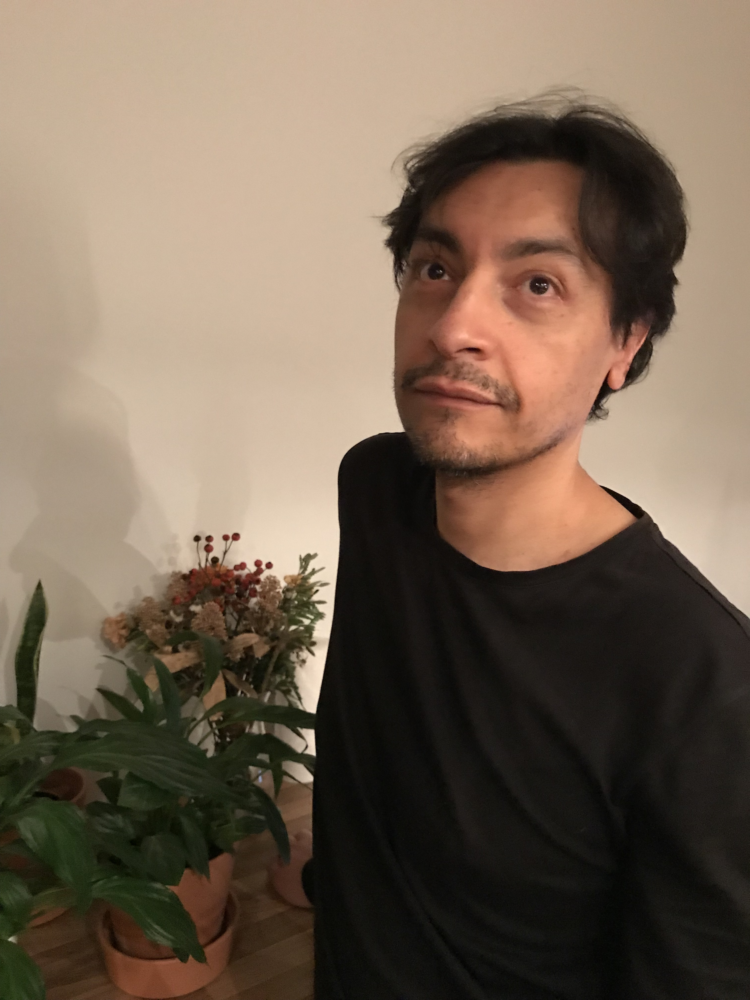

## Introduction

 Welcome to my Github page. I arrived to Finland almost five years ago, and to talk about my current life I should start by confessing that I lead somewhat of a double life. My daytime persona is a dedicated Spanish Philology student at the University of Helsinki, with a wide range of interests in the fields of General Linguistics, Language Education and especially English Philology. This Rogelio is already at the end of his Bachelor level studies, majoring in Spanish Philology with a minor in English as well.

My other persona has inherited some traits from my former profession, the one I had in my home country Chile: I was a professional musician, a choir conductor and gig ensemble singer. I could just describe this side of me as a hobby, rightly so considering that I sing with several other guys at a well known Helsinki based choir. On the other hand, I also still work as a conductor for Symbioosin Kuoro, a very rewarding job.

Fortunately, both personae coordinate activities together and efficiently, with much understanding for each other's needs. And both are tolerated by the most wonderful family imaginable: wife and three children, the youngest one nearly two weeks old.

##### Read my [CV](./assets/CV_of_Rogelio_Gonzalez_Aviles.pdf)

## Find me on

[Facebook](https://www.facebook.com/symbioosinkuoro), [GitHub](https://github.com/Rogelio-hel), [Nimenhuuto](https://symbioosinkuoro.nimenhuuto.com)

## Published Article

[_La creación de léxico humorístico en Les Luthiers_](revistascientificas.filo.uba.ar/index.php/sys/article/view/5510), in the journal **Signo y Seña** from the University of Buenos Aires.

Nothing like creating wacky words just for fun. Only how does this work and how does the coining of funny words difer from regular word coining? If you read Spanish, this is the article to understand this process. The study is based on the work of the Argentinian humor group **Les Luthiers**

## Contact

My email address rogelio.aviles@helsinki.fi

## Courses I've Taken

[Children's Literature](https://courses.helsinki.fi/en/kik-en221/132324666), fall 2019

[Introduction to Language Technology](https://courses.helsinki.fi/en/kik-405/130355898), fall 2019

[Command Line Tools for Linguists](https://courses.helsinki.fi/en/kik-lg219/129824412), fall 2019

[Kirjoita ja keskustele I](https://courses.helsinki.fi/en/finn-310/129279512), fall 2019

[Translation II](https://courses.helsinki.fi/en/kik-en216/130602380), fall 2019

[Topics in English Linguistics I](https://courses.helsinki.fi/en/kik-en116/130602403), fall 2018

## Academic Projects

[Command Line Tools week 7 project, at Github](https://github.com/Rogelio-hel/cmdline-course)

A first try at Github and version control. A Makefile was edited, used to generate files and then the changes reverted. Quite a challenge for a beginner!

## Music Projects

[Contemporary vocal music piece _Historia de una eternidad_](https://www.youtube.com/watch?v=RtcFz_w4TUU)

From 2014, my former contemporary vocal ensemble COPIU sings _Historia de una eternidad_ by Chilean Lucas Alvarado

[Teaching contemporary music in Mexico](https://www.youtube.com/watch?v=x00odau95uI)

March 2014, **Copiu VocalEnsamble** visits Querétaro, Mexico, for sharing experiences on contemporary vocal music

[Bach with Andean instruments](https://www.youtube.com/watch?v=mGqQG3ArWb0&feature=youtu.be)

In 2013 Chilean-German choir **Divertimento** celebrated 500 years of Lutheranism by performing a Bach Cantata with traditional native instruments from the Andean region.
Great collaboration with the folk instrumental group **Barroco Andino**!  

## Misc. 

[YL](https://yl.fi)

Ylioppilaskunnan Laulajat, Finland's oldest Finnish speaking choir.

[Selkouutiset](yle.fi/uutiset/osasto/selkouutiset)

News in clear Finnish, fastest way to improve your Finnish!

[Museo de la Memoria y los Derechos Humanos, Santiago de Chile](https://ww3.museodelamemoria.cl/english-version/)

Chile's human rights museum. To understand what is happening now in Chile it's helpful to have a look at what happened over there 45 years ago. Similar ideas,... and partly similar methods too, what a shame. English version.

[My other self](./assets/images/image1.jpeg) with Symbioosin kuoro
